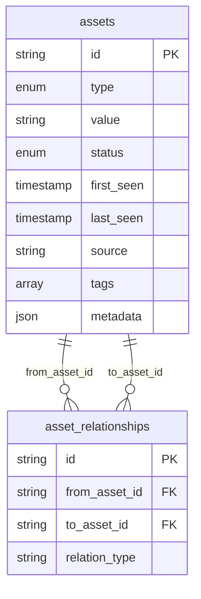

# DarkAtlas — Asset Management API

A self-contained Asset Management module built for Buguard's **DarkAtlas Attack Surface Monitoring (ASM)** platform. Tracks internet-facing assets domains, subdomains, IPs, services, certificates, and technologies with full lifecycle management, deduplication, and relationship graphing.

Built with **Python · FastAPI · PostgreSQL · SQLAlchemy**.

Disclaimer: **This repository contains my solution to a backend internship technical assessment provided by Buguard. It is intended for educational and portfolio purposes only and is not affiliated with Buguard.**

---

## Table of Contents

- [Quick Start](#quick-start)
- [Environment Variables](#environment-variables)
- [Project Structure](#project-structure)
- [API Reference](#api-reference)
- [Running Tests](#running-tests)
- [Design Decisions](#design-decisions)
- [Edge Cases Handled](#edge-cases-handled)
- [Assumptions](#assumptions)
- [Database Schema](#database-schema)


---

## Quick Start

**Prerequisites:** Docker + Docker Compose

```bash
# 1. Clone the repo
git clone https://github.com/MoaidHashem3/buguard-asset-management
cd buguard-asset-management

# 2. Create your .env file
cp .env.example .env
# Edit .env

# 3. Start everything
docker compose up --build

# API is live at:  http://localhost:8000
# Swagger UI at:   http://localhost:8000/docs
# Health check:    http://localhost:8000/health
```

> **Note:** The database tables are created automatically on startup. No migration step needed.

---

## Environment Variables

Copy `.env.example` to `.env` and adjust as needed, you can use these default values

| Variable            | Default                                            | Description                        |
|---------------------|----------------------------------------------------|------------------------------------|
| `DATABASE_URL`      | `postgresql://postgres:postgres@db:5432/darkatlas` | Postgres connection string. Use `db` as host inside Docker, `localhost` when running outside. |
| `POSTGRES_USER`     | `postgres`                                         | Postgres username                  |
| `POSTGRES_PASSWORD` | `postgres`                                         | Postgres password                  |
| `POSTGRES_DB`       | `darkatlas`                                        | Database name                      |
| `API_KEY`           | `your-api-key`                                         | Bearer token required for all write operations |


---

## Project Structure

```
buguard-asset-management/
├── app/
│   ├── auth/
│   │   └── jwt.py              # API key authentication
│   ├── models/
│   │   ├── asset.py            # SQLAlchemy Asset model + enums
│   │   └── relationship.py     # SQLAlchemy AssetRelationship model
│   ├── routes/
│   │   ├── assets.py           # CRUD, filtering, graph, lifecycle
│   │   ├── bulk_import.py      # Bulk import endpoint
│   │   └── relationships.py    # Relationship endpoints
│   ├── schemas/
│   │   ├── asset.py            # Pydantic request/response schemas
│   │   └── relationship.py     # Relationship schemas
│   ├── services/
│   │   ├── deduplication.py    # Upsert + merge logic
│   │   └── lifecycle.py        # Mark-stale logic
│   ├── database.py             # SQLAlchemy engine + session
│   └── main.py                 # FastAPI app entry point
├── tests/
│   └── test_assets.py          # Automated tests
├── .env.example                # Environment variable template
├── docker-compose.yml
├── Dockerfile
├── requirements.txt
└── README.md
```

---

## API Reference

Full interactive documentation is available at **http://localhost:8000/docs** (Swagger UI) once the app is running.

### Authentication

Write operations require an API key passed as a Bearer token:

```
Authorization: Bearer <API_KEY>
```

Read operations (`GET`) are public.

---

### Assets

| Method   | Endpoint                       | Auth | Description                          |
|----------|-------------------------------|------|--------------------------------------|
| `GET`    | `/assets`                     | —    | List assets with filtering, sorting, pagination |
| `POST`   | `/assets`                     | ✅   | Create a single asset                |
| `GET`    | `/assets/{id}`                | —    | Get a single asset                   |
| `PATCH`  | `/assets/{id}`                | ✅   | Update status, tags, or metadata     |
| `DELETE` | `/assets/{id}`                | ✅   | Delete an asset                      |
| `GET`    | `/assets/{id}/graph`          | —    | Get asset + all related assets       |
| `POST`   | `/assets/actions/mark-stale`  | ✅   | Mark assets stale by last-seen age   |

#### List query parameters

| Param           | Type    | Description                                      |
|-----------------|---------|--------------------------------------------------|
| `type`          | enum    | Filter by asset type (`domain`, `subdomain`, etc.) |
| `status`        | enum    | Filter by status (`active`, `stale`, `archived`) |
| `tag`           | string  | Filter by tag (exact match)                      |
| `value_contains`| string  | Filter by value substring (case-insensitive)     |
| `sort_by`       | string  | Sort field: `last_seen`, `first_seen`, `value`, `type`, `status` , `id` |
| `order`         | string  | `asc` or `desc` (default: `desc`)               |
| `page`          | int     | Page number (default: 1)                         |
| `page_size`     | int     | Results per page (default: 20, max: 200)         |

---

### Bulk Import

| Method | Endpoint  | Auth | Description                        |
|--------|-----------|------|------------------------------------|
| `POST` | `/import` | ✅   | Import a list of asset records     |

Accepts a JSON array of asset objects. Idempotent: safe to run multiple times.

Supports inline relationship hints:
- `"parent": "<id>"` → creates a `subdomain_of` relationship
- `"covers": "<id>"` → creates a `covers` relationship
- `"resolves_to": "<id>"` → creates a `resolves_to` relationship

**Example request:**
```json
[
  {
    "id": "a1",
    "type": "domain",
    "value": "example.com",
    "status": "active",
    "source": "scan",
    "tags": ["root"],
    "metadata": {}
  },
  {
    "id": "a2",
    "type": "subdomain",
    "value": "api.example.com",
    "source": "scan",
    "tags": ["prod"],
    "metadata": {},
    "parent": "a1"
  }
]
```

**Example response:**
```json
{
  "created": 2,
  "updated": 0,
  "skipped": 0,
  "errors": []
}
```

---

### Relationships

| Method   | Endpoint               | Auth | Description                    |
|----------|------------------------|------|--------------------------------|
| `GET`    | `/relationships`       | —    | List all relationships (optionally filter by `asset_id`) |
| `POST`   | `/relationships`       | ✅   | Create a relationship          |
| `DELETE` | `/relationships/{id}`  | ✅   | Delete a relationship          |

---

## Running Tests

Tests run against the live Postgres container, so Docker must be running.

```bash
# Run all tests
docker compose exec api bash -c "cd /app && pytest tests/ -v"

# Run a specific test
docker compose exec api bash -c "cd /app && pytest tests/test_assets.py::test_import_idempotent -v"

# Run tests matching a keyword
docker compose exec api bash -c "cd /app && pytest tests/ -v -k dedup"
```

### Test coverage

| Test | What it verifies |
|------|-----------------|
| `test_import_idempotent` | Importing the same dataset twice creates no duplicates |
| `test_dedup_merges_tags` | Tags from two imports are unioned, not overwritten |
| `test_filter_by_type` | Type filter returns only matching assets |
| `test_filter_by_tag` | Tag filter returns only assets with that tag |
| `test_pagination` | Page size and total count are correct |
| `test_mark_stale_via_patch` | PATCH can set an asset to stale |
| `test_stale_asset_reactivated_on_reimport` | A stale asset seen again becomes active |
| `test_relationships_created_on_import` | Inline `parent`/`covers` keys create relationships |
| `test_asset_graph` | `/graph` returns the asset and its neighbours |
| `test_write_requires_auth` | Write endpoints return 401 without API key |
| `test_import_skips_bad_records` | Malformed records are skipped without crashing the batch |

---

## Design Decisions

**Deduplication key:** `(type, value)`  two assets with the same type and value are the same asset, regardless of their ID. This mirrors how real ASM platforms identify assets.

**Merge strategy on conflict:** When the same asset arrives from two sources, tags are unioned and metadata is merged with incoming values winning on key conflicts. This preserves historical data while keeping records current.

**Re-appearing assets:** A stale asset that shows up in a new import is automatically set back to `active`. This handles the common case of an asset going offline temporarily and reappearing.

**ID handling:** Callers may supply their own IDs (useful for seeding from an existing dataset). If omitted, a UUID is generated server-side.

**Relationships as directed edges:** Stored with a `relation_type` label (`subdomain_of`, `covers`, `resolves_to`, etc.). The `/graph` endpoint fetches both directions so callers see the full neighbourhood of an asset.

**Authentication:** Static API key via Bearer token for simplicity, JWT with role-based access control would be the natural next step for production.

**Table creation:** `Base.metadata.create_all()` runs at startup via FastAPI's `lifespan` hook. For a production system, Alembic migrations would replace this.

**Pagination defaults:** Page size defaults to 20 with a hard cap of 200, preventing accidental full-table responses on large inventories.

**Malformed import records:** Each record in a bulk import is processed independently inside a try/except. Failures are collected and returned in the response without aborting the rest of the batch.

---

## Edge Cases Handled

| Edge case | Approach |
|-----------|----------|
| Idempotent imports | Deduplicated on `(type, value)`; re-importing updates `last_seen` and merges data |
| Conflicting metadata from two sources | Incoming values win on key conflicts; missing keys are preserved |
| Re-appearing stale assets | Status reset to `active` on re-import |
| Malformed/partial import records | Per-record try/except; failures reported in response, batch continues |
| Large inventories | Pagination with sane defaults (20 per page, max 200) |
| Certificate lifecycle | `expires` stored in metadata; filterable by `tag` and `status` |
| Duplicate relationships | Checked before insert; exact duplicates are silently ignored |

---

## Assumptions

- Asset uniqueness is defined by `(type, value)`. Two assets with the same type and value from different sources are treated as the same asset.
- The `source` field is informational, it does not affect deduplication or merge priority.
- Relationship direction is meaningful: `from_asset → to_asset` with a label. The `/graph` endpoint returns both directions.
- Certificate expiry analysis is left to the consumer, the API stores and surfaces the `expires` field in metadata and via tag/status filtering.

---

## Database Schema


